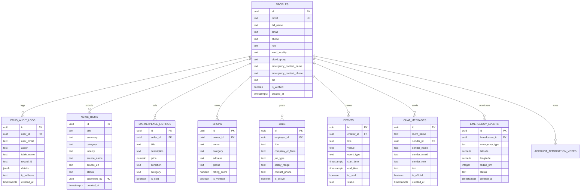

# MyHarur System Architecture & Implementation Specification (SYSTEM.md)

> **Document Version:** 2.0.0  
> **Target Release:** Production / Web & Mobile  
> **Town Focus:** Harur Taluk & Dharmapuri District, Tamil Nadu  
> **Last Verified:** August 2026  

---

## Table of Contents
1. [Executive Summary & Technology Stack](#1-executive-summary--technology-stack)
2. [Workspace & Folder Structure](#2-workspace--folder-structure)
3. [User Interface (UI) & Design System](#3-user-interface-ui--design-system)
4. [Database Schema & Data Models](#4-database-schema--data-models)
5. [Backend Services & Edge Functions](#5-backend-services--edge-functions)
6. [Security, Roles & Multi-Admin Governance](#6-security-roles--multi-admin-governance)
7. [External Integrations & Meteorological Service](#7-external-integrations--meteorological-service)
8. [Build, Deployment & Hosting](#8-build-deployment--hosting)

---

## 1. Executive Summary & Technology Stack

**MyHarur** is a hyper-local, trusted civic and community platform purpose-built for the residents, farmers, shop owners, and town administrators of **Harur** and the greater **Dharmapuri district** in Tamil Nadu.

### Core Stack
* **Frontend Framework:** Flutter 3.x / Dart 3.3+ (Compiled for Web and Android)
* **Backend Platform:** Supabase (Self-hosted / Cloud on `ap-south-1`)
  * **Database:** PostgreSQL 15+ with `pgcrypto` & `uuid-ossp` extensions
  * **Authentication:** Supabase Auth (Email/Password, Google OAuth 2.0, Staff AID Credentials)
  * **Edge Runtime:** Deno / TypeScript Edge Functions
  * **Realtime:** Postgres Change Streams & WebSocket broadcast channels for Town Chat
  * **Storage:** Supabase Storage with signed private buckets for emergency media & public buckets for storefronts
* **External APIs:**
  * **Open-Meteo API:** Live meteorological and agro-weather observations for Harur (12.0624° N, 78.4983° E) and Dharmapuri (12.1357° N, 78.1584° E)
  * **Google Gemini 1.5 Flash:** Multilingual civic AI support assistant with automatic 3-strike admin ticket escalation
* **DevOps & Hosting:**
  * Render Static Hosting / Docker + Nginx
  * GitHub Actions CI/CD Pipeline

---

## 2. Workspace & Folder Structure

```text
myharur/
├── .github/
│   └── workflows/
│       └── flutter_ci.yaml          # Continuous Integration & automated web bundle builder
├── android/                         # Native Android host project & manifests
├── assets/
│   ├── brand/
│   │   └── app_icon.png             # MyHarur official emblem & branding
│   └── icons/                       # 12 Custom SVG Town Vector Assets
│       ├── bell.svg                 # Notifications & alerts icon
│       ├── cloud.svg                # Weather & climate icon
│       ├── compass.svg              # Explore & directory icon
│       ├── heart.svg                # Donations & helping hands icon
│       ├── home.svg                 # Home feed icon
│       ├── lock.svg                 # Passkey & security icon
│       ├── news.svg                 # News items & press releases icon
│       ├── pin.svg                  # Location & GPS geofencing icon
│       ├── shield.svg               # Verified source & moderation icon
│       ├── sparkle.svg              # AI assistant & highlight icon
│       ├── trophy.svg               # Rankings & leaderboards icon
│       └── user.svg                 # Account & profile icon
├── docs/                            # Deep architectural & operational documentation
│   ├── ARCHITECTURE.md              # High-level component topology & data flow
│   ├── DELIVERY_PHASES.md           # Milestone & sprint roadmap
│   ├── LOCAL_RUN.md                 # Local development & Flutter run guide
│   ├── PRODUCT_PLAN.md              # Product requirements & feature backlog
│   ├── SECURITY.md                  # Cryptographic standards, Argon2id & RLS security model
│   └── UI_DIRECTION.md              # Visual aesthetic, color theory & design principles
├── lib/                             # Core Flutter application source code
│   ├── features/                    # Modular feature pages & presentation components
│   │   ├── admin_dashboard_page.dart# Administrative governance, 3-vote consensus & G.O. publisher
│   │   ├── auth_page.dart           # Resident login/signup, Google OAuth & Staff AID entry
│   │   ├── chat_page.dart           # Real-time Town Chat room with @mentions & official badges
│   │   ├── events_page.dart         # Tournaments & festivals with automatic Event Head allocation
│   │   ├── jobs_page.dart           # Local job vacancies & farm daily wage postings
│   │   ├── marketplace_page.dart    # Peer-to-peer buy & sell marketplace for tools/agro/goods
│   │   ├── onboarding_page.dart     # 3-step interactive onboarding with MMID preview
│   │   ├── phase_two_pages.dart     # Location picker, News hub, Weather hub, Emergency SOS beacon
│   │   ├── rankings_page.dart       # Community leaderboards (Interaction, Helping Hands, Donations)
│   │   └── shops_page.dart          # Local storefront directory with 2-shop limit enforcement
│   ├── services/
│   │   └── supabase_service.dart    # Unified service layer (Auth, DB, Realtime, Open-Meteo, Gemini AI)
│   └── main.dart                    # Application entry point, AppTheme, TownShell & drawer navigation
├── supabase/                        # Backend Supabase configuration & Edge functions
│   ├── functions/
│   │   ├── _shared/
│   │   │   └── cors.ts              # Reusable CORS headers for Deno edge functions
│   │   ├── admin-governance/        # Edge function for 3-vote consensus & superadmin termination
│   │   │   └── index.ts
│   │   ├── auth-staff-login/        # Edge function for Argon2id verification & AID authentication
│   │   │   └── index.ts
│   │   ├── create-emergency/        # Edge function for idempotent emergency case dispatch
│   │   │   └── index.ts
│   │   ├── ingest-news/             # Edge function for automated RSS & news feed scraping
│   │   │   └── index.ts
│   │   ├── keep-alive/              # Pinned keep-alive health check to eliminate cold starts
│   │   │   └── index.ts
│   │   └── refresh-weather/         # Edge function for periodic Open-Meteo cache warming
│   │       └── index.ts
│   └── migrations/                  # Incremental database SQL migrations
│       ├── 20260814000100_base_identity.sql
│       ├── 20260814000200_phase_two_trust_and_safety.sql
│       ├── 20260814000300_phase_three_and_four_community_and_commerce.sql
│       ├── 20260814000400_argon2_and_advanced_governance.sql
│       └── 20260815000100_full_production_schema_and_root_admin.sql
├── test/                            # Unit and widget test suite
├── web/                             # Web target assets, manifest.json & index.html
├── Dockerfile                       # Container definition for Nginx web hosting
├── generate_icons.py                # Asset generator for SVG icons
├── nginx.conf                       # Production reverse proxy configuration
├── pubspec.yaml                     # Flutter dependencies and asset registrations
├── render.yaml                      # Render Blueprint deployment configuration
├── supabase_schema.sql              # Consolidated SQL schema ready for Supabase SQL Editor
└── SYSTEM.md                        # Master system blueprint (this file)
```

---

## 3. User Interface (UI) & Design System

The MyHarur UI is crafted around modern Material 3 design principles with tailored typography, custom SVG icon sets, and micro-interactions.

### 3.1 Design Tokens & Color Palette
* **Deep Forest Ink (`#15211F`):** Primary text color, headings, and high-emphasis UI elements.
* **Harur Emerald Green (`#007F63`):** Brand identity color, verified badges, action buttons, active tabs.
* **Soft Mist (`#F2F6F5`):** Subtle background fill for input fields, inactive chips, and card containers.
* **Subtle Line (`#DCE5E1`):** Border outlines and section dividers.
* **Emergency Crimson (`#E44545`):** SOS panic beacons, alerts, hotlines, and destructive actions.
* **Atmospheric Blue (`#267AF4`):** Weather cards, government announcements, and transit updates.
* **Advisory Amber (`#F59E0B`):** Agricultural alerts and caution notices.

### 3.2 Key Screens & Navigation Flows

1. **TownShell (Main Navigation):**
   * **Floating Glassmorphic Bottom Bar:** Uses `BackdropFilter` (sigma 20) with rounded 38px corners hosting 4 primary tabs:
     * **Home:** Real-time town announcements, live weather forecast widget, quick access emergency banner, verified local news feed, and local marketplace carousel.
     * **Explore:** Categorized directory of town services, registered shops, job vacancies, tournaments, and government orders.
     * **Alerts:** Emergency broadcast list, civic water/electricity maintenance schedules, and weather warnings.
     * **Account:** Resident identity card, unique MMID display, interaction/helping hand stats, personal details manager, security passkey toggle, and sign-out.
   * **TownDrawer:** Slide-out drawer with quick-navigation shortcuts to all 10 feature modules, town hotline numbers, and root admin panel.

2. **Onboarding & Authentication (`TownOnboardingFlowPage` & `AuthPage`):**
   * 3-step carousel explaining digital identity, verified town services, and panic SOS dispatch.
   * Dual login tabs: **Resident Login** (Email/Password or Google OAuth) and **Town Staff / Official Login** (Username + Argon2 password + AID).
   * MMID preview dynamically rendered during signup.

3. **Emergency & Safety Hub (`EmergencyReportPage`):**
   * **Radius Selector:** Dynamic broadcast distance pill buttons (`1 km`, `5 km`, `10 km`).
   * **Emergency Nature Dropdown:** Medical, Road Accident, Fire, Disaster, Elderly assistance.
   * **Active Beacon Modal:** Instant case ID assignment (`#HR-XXXXX`), status monitoring, and resolution button.
   * **Direct Dial Hotlines:** Harur Police (`04346-222100`), Ambulance (`108`), Fire Station (`101`), Harur GH (`04346-222033`), Women Helpline (`181`).

4. **Town Chat (`TownChatPage`):**
   * Real-time messaging with `@username` tagging.
   * Official badges for Town Admins and Government Officials (`G.O.` badge).
   * Temporary Event chat rooms created automatically upon event approval.

5. **Admin Governance & Passkey Dashboard (`AdminDashboardPage`):**
   * Protected by **SuperAdmin PIN / Passkey gate** with failed attempt tracking.
   * **Moderation Queue:** One-tap approval/rejection for news submissions and event proposals.
   * **3-Admin Consensus Termination:** Displays voting tally (`X / 3 votes`) with instant SuperAdmin bypass capability.
   * **Admin & MFA Management:** List of all active AIDs, role assignment, and multi-factor status.
   * **Official User Creation:** Generator for `@official_handle` with reserved username enforcement and AID issuance.
   * **G.O. Publisher:** Direct form to publish official Government Orders with reference numbers.
   * **AI Escalation Queue:** Review escalated queries where the automated Gemini chatbot reached 3 strikes.

---

## 4. Database Schema & Data Models

The database schema is fully defined in [supabase_schema.sql](file:///d:/myharur/supabase_schema.sql) and executed with strict Row Level Security (RLS).



### 4.1 Identifiers & Role Invariants
1. **MMID (MyHarur Member Identifier):**
   * Format: `YYYYMMDDHHMMSS` + 4 random digits (e.g., `202608151208218821`).
   * Unique, non-transferable resident identifier generated upon account registration.
2. **AID (Admin Identifier):**
   * Format: `AID-YYYYMMDD-XXXX` (e.g., `AID-20260815-77XA`).
   * Issued only to verified Town Administrators, Government Officials, and Moderators.
3. **Root SuperAdmin Seed:**
   * Root User: `admin.qenbel@gmail.com` (`SUPERADMIN-0001` / `AID-ROOT-0001`).
   * Role: `superadmin` with absolute consensus bypass authority.

---

## 5. Backend Services & Edge Functions

All services in [lib/services/supabase_service.dart](file:///d:/myharur/lib/services/supabase_service.dart) are designed with **offline-first fallbacks**, ensuring seamless UI preview and offline operation if Supabase credentials are not connected.

### 5.1 Service Inventory
* **`SupabaseConfig`:** Initializes Supabase Flutter SDK using environment variables (`SUPABASE_URL`, `SUPABASE_ANON_KEY`) with graceful fallback.
* **`SecurityFilterService`:** Validates handles against 30+ reserved town administrative usernames and scans text against a multilingual blacklist (English, Tamil transliterated, and Hindi transliterated).
* **`AuditLogService`:** Records every critical mutation (`LOGIN`, `SIGNUP`, `UPDATE_PROFILE`, `REGISTER_SHOP`, `EMERGENCY_BROADCAST`, `TERMINATE_USER`) into `crud_audit_logs`.
* **`AuthService`:** Manages resident sessions, password changes, Google OAuth, and profile caching.
* **`GeminiAISupportService`:** Connects to Gemini 1.5 Flash API with local town FAQ fallback and manages the 3-strike escalation counter.
* **`EmergencySOSManager` & `EmergencyService`:** Calculates Haversine distance and computes dynamic notification expansion rings.
* **`GovtService`:** Fetches and publishes official Tamil Nadu Government Orders (G.O.).
* **`LeaderboardService`:** Computes resident interaction scores, helping hands metrics, and donation tiers (Platinum, Gold, Silver, Bronze).
* **`ShopAdminManager`:** Strictly enforces the **2-shop limit** per user (with SuperAdmin override).
* **`GovernanceService`:** Coordinates 3-vote multi-admin consensus for account termination.
* **`NewsService`, `MarketplaceService`, `JobsService`, `EventsService`, `ChatService`:** Core CRUD and Realtime channel handlers.
* **`WeatherService`:** Connects directly to Open-Meteo to fetch live temperature, apparent temperature, humidity, and wind speed.

### 5.2 Supabase Deno Edge Functions
* [auth-staff-login](file:///d:/myharur/supabase/functions/auth-staff-login/index.ts): Argon2id password verification, 5-attempt rate-limiting lockout (15 minutes), and mandatory Google account linking check.
* [admin-governance](file:///d:/myharur/supabase/functions/admin-governance/index.ts): Handles `vote_terminate`, `superadmin_terminate`, `assign_aid`, `revoke_aid`, `approve_news`, and `approve_event` (with auto chat room creation).
* [create-emergency](file:///d:/myharur/supabase/functions/create-emergency/index.ts): Idempotent emergency case generator with 1000m initial dispatch attempt.
* [keep-alive](file:///d:/myharur/supabase/functions/keep-alive/index.ts): Health-check endpoint to eliminate cold starts.
* [refresh-weather](file:///d:/myharur/supabase/functions/refresh-weather/index.ts): Background cron worker to refresh Harur & Dharmapuri weather caches.

---

## 6. Security, Roles & Multi-Admin Governance

### 6.1 Multi-Role Hierarchy
1. **Resident (`resident`):** Standard town member; can browse all services, submit news for review, create up to 2 shops, list marketplace items, apply for jobs, and send SOS beacons.
2. **Shop Admin (`shop_admin`):** Verified shop owner; can manage catalog, post product discounts, and chat with customers.
3. **Event Head (`event_head`):** Assigned automatically upon event approval; moderates dedicated event chat room.
4. **Moderator (`moderator`):** Reviews news submissions, reports, and community marketplace posts.
5. **Government Official (`govt_official`):** Issues official G.O. bulletins, responds to civic grievances with an official seal.
6. **Town Admin (`admin`):** Manages local moderation, issues AIDs, and votes on account termination.
7. **SuperAdmin (`superadmin`):** Maximum authority (capped at 3 accounts system-wide); holds immediate instant-termination override and passkey control.

### 6.2 3-Admin Termination Consensus
To prevent arbitrary account bans, a non-superadmin moderator must submit an account termination vote. The account is suspended only when **3 distinct administrators** vote to confirm the termination. The Root SuperAdmin can bypass this requirement instantly for severe violations.

---

## 7. External Integrations & Meteorological Service

### 7.1 Automated Meteorological Forecast
* Coordinates:
  * **Harur:** Lat `12.0624° N`, Lon `78.4983° E`
  * **Dharmapuri:** Lat `12.1357° N`, Lon `78.1584° E`
* Source: Open-Meteo Forecast API (`temperature_2m`, `relative_humidity_2m`, `apparent_temperature`, `precipitation`, `weather_code`, `wind_speed_10m`).
* WMO Weather Code interpreter maps codes to plain descriptions (e.g., *Morning Mist*, *Passing Rain Showers*, *Thunderstorm & Lightning*).

### 7.2 Gemini AI Town Assistant
* Model: `gemini-1.5-flash`
* System Prompt: Dedicated civic assistant for Harur and Dharmapuri, answering queries in both English and Tamil.
* 3-Strike Escalation: If a resident query cannot be resolved after 3 attempts or if the resident types "escalate", the ticket is routed directly to the Town Admin Queue.

---

## 8. Build, Deployment & Hosting

### 8.1 Local Execution
```bash
# Get dependencies
flutter pub get

# Run on Chrome (Web browse-only preview)
flutter run -d chrome --dart-define=SUPABASE_URL="https://your-project.supabase.co" --dart-define=SUPABASE_PUBLISHABLE_KEY="your-publishable-key"

# Run on Android device
flutter run -d android --dart-define=SUPABASE_URL="https://your-project.supabase.co" --dart-define=SUPABASE_PUBLISHABLE_KEY="your-publishable-key"
```

### 8.2 Production Build
```bash
# Build optimized Web bundle via Docker
docker build \
  --build-arg SUPABASE_URL="https://your-project.supabase.co" \
  --build-arg SUPABASE_PUBLISHABLE_KEY="your-publishable-key" \
  -t myharur-web .

# Build Android APK
flutter build apk --release \
  --dart-define=SUPABASE_URL="https://your-project.supabase.co" \
  --dart-define=SUPABASE_PUBLISHABLE_KEY="your-publishable-key"
```

### 8.3 Hosting Topology & Pipeline
* **Web Client (Render):** Deployed via `render.yaml` using `env: docker` and [Dockerfile](file:///d:/myharur/Dockerfile). Build-time environment variables (`SUPABASE_URL`, `SUPABASE_PUBLISHABLE_KEY`) are injected during the Docker build stage.
* **Android CI & Release (.github/workflows/ci.yml):** Builds release APK with injected secrets (`SUPABASE_URL`, `SUPABASE_PUBLISHABLE_KEY`), verifies syntax & tests, creates tagged GitHub releases per version, and uploads the APK artifact.
* **Backend:** Cloud Supabase on `ap-south-1` (Mumbai) region. OAuth redirect URI `com.myharur.app://login-callback` is handled by AndroidManifest's intent-filter.


---
*MyHarur — Digital Town Platform for Harur & Dharmapuri.*
